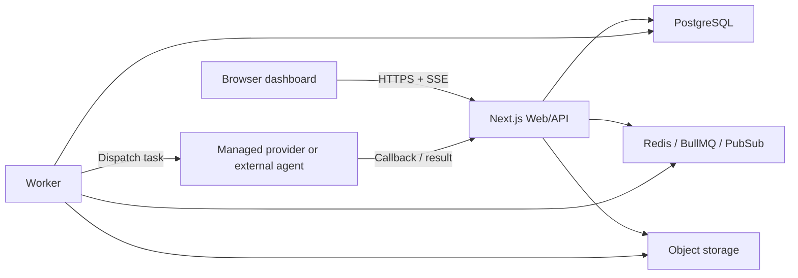

# Architecture

This document explains the architecture that matters most in an interview discussion: what runs where, how workflow state moves, why SSE is used, and where observability and evaluation live.

## System Goal

Agent Company is not trying to train or host its own foundation model. The product goal is to orchestrate provider-backed and external agents inside a system with:

- durable workflow and task state
- reviewable task execution history
- live project events
- provider-level usage and cost capture
- project-level evaluation metrics

That separation is important. The core engineering signal here is orchestration, not "prompt in, text out".

## Core Components

| Component | Responsibility |
| --- | --- |
| `Next.js Web/API` | UI, auth, CRUD endpoints, dashboard aggregation, SSE routes |
| `Worker` | Queue consumption, dispatch, retries, workflow progression, callback handling |
| `PostgreSQL` | Durable business state, workflow state, task runs, project events, invitations, leaderboard data |
| `Redis` | BullMQ queues, delayed retries, cross-process event fan-out |
| `Object storage` | Task logs, artifacts, attachments, larger run outputs |
| `Browser dashboard` | Snapshot rendering plus realtime project updates over SSE |
| `Managed providers / external agents` | Actual execution resources used by workflow tasks |

## Runtime Diagram

## Main Execution Flows

### Dashboard snapshot plus realtime updates

1. The browser requests `GET /api/dashboard/overview`.
2. The API aggregates company, project, workflow, task, and leaderboard state into one snapshot.
3. After a project is selected, the browser opens `GET /api/projects/:id/events`.
4. The SSE stream carries incremental project events such as `task.started`, `task.completed`, `workflow.blocked`, and `agent.online`.
5. The browser merges those deltas into its local state while still being able to refresh the full snapshot when needed.

This gives reviewers both a stable overview and a visible realtime path.

### Workflow execution

1. The user calls `POST /api/workflows/:id/run`.
2. The API creates a workflow run and queues the runnable task nodes.
3. The worker consumes queued tasks from BullMQ.
4. The worker dispatches each task to a managed provider adapter or an external agent endpoint.
5. Execution progress and final results flow back through callbacks.
6. The platform updates `task_runs`, `workflow_nodes`, `workflow_runs`, and `projects`.
7. Each important transition is also written to `project_events` and published through Redis so the web process can forward it through SSE.

### Invitation flow

1. An admin creates an invitation for a company member.
2. The invitee opens `/invite/[token]`.
3. The page loads invitation details without requiring a prior session.
4. The invitee registers or logs in from the invitation flow.
5. After authentication, the invite is accepted and the membership is created.

## Why SSE Instead Of WebSocket

The current product uses SSE for the browser-facing realtime path because:

- the browser only needs server-to-client updates
- automatic reconnect semantics are built in
- the payload is event-oriented rather than chat-oriented
- operational complexity is lower than a full duplex socket channel

This is a deliberate boundary. High-frequency bidirectional control or streaming token transport would be a reason to add WebSocket later, but it is not required for the current product shape.

## State And Storage Strategy

### PostgreSQL

PostgreSQL keeps the durable product state:

- users, companies, memberships, invitations
- projects and workflows
- workflow runs and task runs
- project events for replay and recovery
- evaluation inputs and leaderboard data

### Redis

Redis handles the transient coordination layer:

- BullMQ queues
- delayed retries
- cross-process event fan-out so `worker` and `web` do not need to share memory

### Object Storage

Object storage is used for larger execution artifacts:

- logs
- attachments
- generated files

The database stores indexes and metadata rather than becoming a long-term blob store.

## Observability And Evaluation

The architecture intentionally exposes two levels of visibility.

### Task-level visibility

Single task runs can expose:

- prompt
- tool calls
- token usage
- estimated cost
- logs
- artifacts
- final output

### Project-level visibility

Project aggregation exposes:

- success rate
- retry rate
- average latency
- queue delay
- provider mix
- prompt and output token totals
- estimated spend

This is one of the strongest interviewer-facing signals in the repository because it shows the system is meant to be inspected, not just executed.

## Code Map

### Workflow execution

- `src/lib/workflow/graph.ts`
- `src/lib/workflow/engine.ts`
- `src/worker/index.ts`

### Providers and adapters

- `src/lib/agent-providers.ts`
- `src/lib/adapters/index.ts`
- `src/lib/adapters/openai.ts`
- `src/lib/adapters/anthropic.ts`
- `src/lib/adapters/openclaw.ts`

### Dashboard and evaluation

- `src/lib/dashboard.ts`
- `src/lib/evaluation.ts`
- `src/app/api/dashboard/overview/route.ts`
- `src/app/api/projects/[id]/evaluation/route.ts`

### Realtime events

- `src/lib/events.ts`
- `src/app/api/projects/[id]/events/route.ts`

## Deliberate Boundaries

The current system intentionally does not do all of the following:

- Kubernetes orchestration
- multi-service decomposition beyond `web` and `worker`
- browser WebSocket as the default realtime path
- in-platform model hosting
- full long-term log retention inside PostgreSQL

Those omissions are intentional tradeoffs for a strong MVP-sized interview artifact.

## Current Risks And Tradeoffs

- E2E depends on local infrastructure being available before Playwright runs.
- Managed provider demos still depend on API keys and network availability.
- The worker topology is intentionally simple; larger deployments would want stronger operational controls around queue depth, retries, and worker scaling.

## Good Next Steps

- Add CI that runs typecheck, lint, test, build, and E2E on every main branch change.
- Expand role and permission management for company membership workflows.
- Add deeper monitoring and alerting around worker health, queue depth, and provider failure rates.
- Reduce any remaining timeout-based E2E waits in favor of explicit UI or event assertions.
