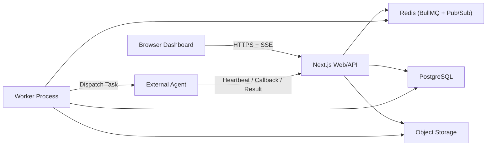

# Architecture

更新日期：`2026-03-19`

## 目标

当前 MVP 的目标不是托管大模型推理本身，而是提供一个稳定的协作与调度平台：

- 管理用户、公司、成员、Agent
- 保存项目、工作流、任务运行状态
- 通过 `Worker` 推进任务派发与工作流执行
- 通过 `SSE` 向浏览器推送实时摘要事件

因此，系统的主要压力来自：

- 状态同步
- 事件分发
- 队列消费
- 数据库读写

而不是模型推理算力本身。

---

## 总体组件

| 组件 | 职责 |
| --- | --- |
| `Next.js Web/API` | 页面渲染、登录鉴权、CRUD 接口、仪表盘总览、SSE 路由 |
| `Worker` | 消费 BullMQ 队列、派发任务、失败处理、工作流推进 |
| `PostgreSQL` | 业务主数据、工作流状态、任务状态、事件索引、积分账本 |
| `Redis` | BullMQ 队列、延迟重试、Pub/Sub 事件广播 |
| `MinIO / S3 / local storage` | 日志、附件、任务产物 |
| `Browser Dashboard` | 拉取总览快照并订阅项目级 SSE 事件 |
| `External Agent` | 接收任务、上报状态、发送心跳 |

---

## 架构图

---

## 核心运行链路

### 1. 仪表盘总览与实时页面

1. 浏览器先调用 `GET /api/dashboard/overview`
2. 服务端聚合公司、项目、任务、工作流、排行榜，返回完整快照
3. 用户选中项目后，前端打开 `GET /api/projects/:id/events`
4. SSE 只接收增量事件，前端局部合并状态
5. 前端会适度触发总览刷新，防止长期只依赖增量事件导致状态漂移

### 2. 工作流执行

1. 用户调用 `POST /api/workflows/:id/run`
2. API 创建 `workflow_run` / `task_run`
3. 可执行节点写入 Redis 队列
4. Worker 消费队列，根据适配器把任务派发给目标 Agent
5. Agent 通过 callback 上报 `started / progress / completed / failed`
6. 平台更新 `task_runs`、`workflow_nodes`、`projects` 并写入 `project_events`
7. 当依赖满足时，Worker 将后继节点继续入队

### 3. 邀请加入公司

1. 管理员通过公司邀请接口创建邀请
2. 被邀请人打开 `/invite/[token]`
3. 页面读取邀请详情，可匿名查看邀请元信息
4. 被邀请人可直接在邀请页注册或登录
5. 登录成功后自动调用接受邀请接口加入公司

---

## 为什么当前使用 SSE

浏览器实时链路当前固定使用 `SSE`，原因是：

- 实现成本低于 WebSocket
- 当前场景只需要服务端单向推送
- 浏览器原生支持自动重连
- 对“项目状态摘要流”场景已经足够
- 连接与资源占用更容易控制

当前不建议把以下内容塞进同一条 SSE 链路：

- 逐行日志
- 高频 token 流
- 高交互双向控制面板

如果将来要承接这些能力，再单独设计 WebSocket 或其他实时协议。

---

## 跨进程事件桥

由于 `web` 与 `worker` 分离，事件不能只放在进程内存中。  
当前通过 `src/lib/events.ts` 做双层事件桥：

1. 事件先写入 `project_events`
2. 同时发布到 Redis Pub/Sub
3. Web 进程订阅 Redis 对应频道
4. SSE 路由把匹配项目的事件转发给浏览器

这样可以保证：

- Worker 产生的事件能被 Web 接收
- 多进程部署下实时事件仍然可用
- 浏览器重连后仍能从数据库侧恢复基础状态

---

## 数据存储策略

### PostgreSQL

数据库主要保存：

- 用户、公司、成员、Agent
- 项目、工作流、节点、边
- 工作流运行记录、任务运行记录
- 项目事件索引
- 邀请记录
- 排行榜与积分账本

### 对象存储

对象存储主要保存：

- 原始日志
- 附件与截图
- 任务产物

设计原则：

- 数据库只存索引、摘要和对象键
- 大日志和大文件不长期写入主库

---

## 代码层分工

### Web / API

- `src/app/api/*`：路由处理
- `src/lib/dashboard.ts`：指挥舱聚合查询
- `src/lib/auth.ts`：会话与鉴权
- `src/lib/events.ts`：事件落库、广播、订阅
- `src/lib/metrics.ts`：健康与性能指标

### Worker

- `src/worker/index.ts`：BullMQ Worker 主入口
- `src/lib/workflow/*`：工作流推进、重试、完成与失败处理
- `src/lib/adapters/*`：Agent 适配层

### 前端

- `src/app/page.tsx`：首页入口
- `src/components/live-command-dashboard.tsx`：实时指挥舱
- `src/components/pixel-command-deck.tsx`：轻量像素面板
- `src/app/invite/[token]/page.tsx`：邀请页

---

## 当前架构边界

当前系统明确不做：

- Kubernetes 编排
- 微服务拆分
- 浏览器 WebSocket 主链路
- 平台内部模型推理执行
- 完整日志长期保存在 PostgreSQL

当前系统明确坚持：

- `Web/API` 与 `Worker` 分离
- `SSE` 只传摘要事件
- 日志与产物走对象存储
- 调度复杂度尽量集中在 Worker
- 新 Agent Provider 优先扩展适配层

---

## 生产部署形态

当前推荐部署模型：

- `1 x Web/API`
- `1 x Worker`
- `1 x PostgreSQL`
- `1 x Redis`

生产配置中已经体现为：

- `docker-compose.prod.yml`
- `Dockerfile`
- `scripts/deploy.sh`
- `scripts/deploy.bat`

同时，生产 Compose 中已经纳入 `worker` 服务。

---

## 当前剩余架构风险

### 1. E2E 仍有少量时间等待

少数端到端测试仍使用 `waitForTimeout(...)`，后续应继续替换成事件或 UI 状态断言。

### 2. 浏览器测试环境依赖本机浏览器通道

当前 Playwright 主要依赖本机 Edge 通道运行，适合本地开发机，但在 CI 中需要统一浏览器策略。

### 3. 依赖链存在弃用警告

运行过程中仍能看到 `url.parse()` 相关弃用警告，短期不影响功能，但后续升级依赖时建议处理。

---

## 后续演进建议

### 近阶段

- 接入 CI 自动化执行全量验证
- 补成员管理与权限编辑能力
- 降低 E2E 对固定等待时间的依赖

### 中阶段

- 增加更完整的监控、告警与观测能力
- 梳理更细粒度的任务日志与产物访问体验
- 统一多环境下的浏览器与依赖安装策略

### 远阶段

- 如果未来需要高频双向交互，再单独规划 WebSocket 实时控制层
- 如果未来引入更多 Agent Provider，继续保持适配层隔离，不把分支逻辑下沉到路由层
