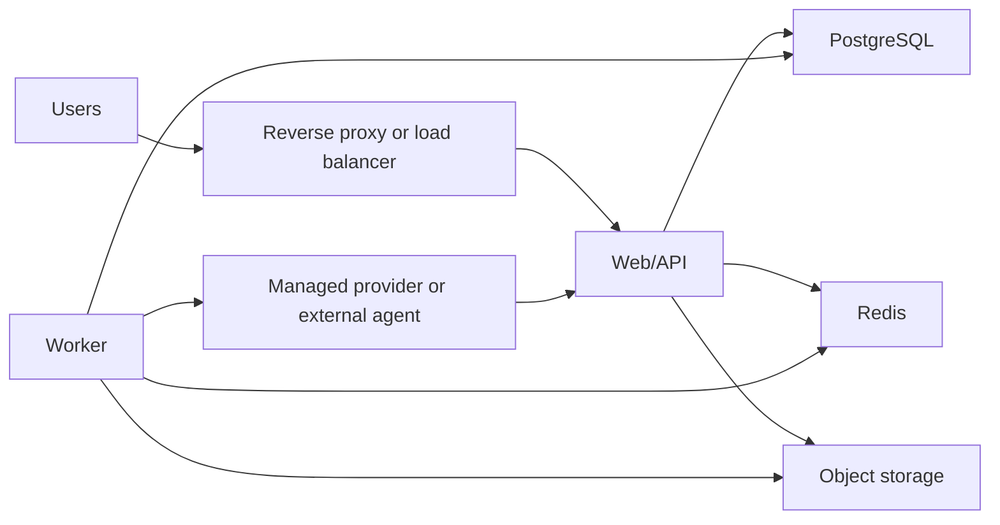

# Deployment Guide

This guide covers the two deployment shapes that matter for this repository:

- Docker Compose on a single host
- manual app plus worker deployment against existing PostgreSQL and Redis services

## Recommended Deployment Shapes

### Fastest path: Docker Compose

Use `docker-compose.prod.yml` when you want the quickest reproducible setup for:

- one web process
- one worker process
- one PostgreSQL instance
- one Redis instance

This is the easiest production-like deployment for demos, internal reviews, and small environments.

### Existing infrastructure path

Use manual deployment when you already have:

- managed PostgreSQL
- managed Redis
- your own reverse proxy or load balancer
- your own object storage

## Prerequisites

### Docker Compose path

- Docker Engine or Docker Desktop with Compose v2

### Manual deployment path

- Node `22.x`
- pnpm `10.x`
- PostgreSQL `15+`
- Redis `7+`
- optional S3-compatible storage

## Runtime Topology



## Docker Compose Deployment

### 1. Prepare the environment

```bash
cp .env.example .env.production
```

Edit `.env.production` before deployment.

When using `docker-compose.prod.yml`, make sure internal service URLs use Docker service names such as `db` and `redis` instead of `127.0.0.1`.

Example:

```env
DATABASE_URL="postgresql://agentcompany:${POSTGRES_PASSWORD}@db:5432/agentcompany?schema=public"
REDIS_URL="redis://redis:6379"
APP_URL="https://your-domain.example"
AUTH_SECRET="replace-with-a-long-random-secret"
ENCRYPTION_KEY="replace-with-32-hex-or-random-bytes"
STORAGE_DRIVER="local"
```

### 2. Build and start the stack

```bash
docker compose --env-file .env.production -f docker-compose.prod.yml up -d --build
```

### 3. Run production migrations

```bash
docker compose --env-file .env.production -f docker-compose.prod.yml exec app pnpm db:migrate:deploy
```

### 4. Verify health

```bash
curl http://localhost:3000/api/health
curl http://localhost:3000/api/health/extended
```

### 5. Inspect logs

```bash
docker compose --env-file .env.production -f docker-compose.prod.yml logs -f
```

## Manual Deployment

### 1. Install dependencies

```bash
pnpm install --frozen-lockfile
```

### 2. Configure the environment

```bash
cp .env.example .env.production
```

At minimum, configure:

- `DATABASE_URL`
- `REDIS_URL`
- `APP_URL`
- `AUTH_SECRET`
- `ENCRYPTION_KEY`

### 3. Run database migrations

```bash
pnpm db:migrate:deploy
```

### 4. Build the app

```bash
pnpm build
```

### 5. Start web and worker

Terminal 1:

```bash
pnpm start
```

Terminal 2:

```bash
pnpm worker
```

Put a reverse proxy in front of the web process and make sure both processes point at the same PostgreSQL and Redis instances.

## Environment Variables

| Variable | Purpose | Required |
| --- | --- | --- |
| `DATABASE_URL` | PostgreSQL connection string | Yes |
| `REDIS_URL` | Redis connection string | Yes |
| `APP_URL` | Public application URL | Yes |
| `AUTH_SECRET` | Session/auth secret | Yes |
| `AGENT_CALLBACK_SECRET` | Optional callback guard | No |
| `ENCRYPTION_KEY` | Encryption key for sensitive values | Yes |
| `STORAGE_DRIVER` | `local` or `s3` | No |
| `S3_ENDPOINT` | S3 or MinIO endpoint | No |
| `S3_REGION` | S3 region | No |
| `S3_BUCKET` | Storage bucket | No |
| `S3_ACCESS_KEY` | S3 access key | No |
| `S3_SECRET_KEY` | S3 secret key | No |
| `HEARTBEAT_INTERVAL_SECONDS` | Agent heartbeat interval | No |
| `HEARTBEAT_TTL_SECONDS` | Agent heartbeat timeout | No |
| `WORKER_CONCURRENCY` | Worker concurrency | No |
| `TASK_MAX_RETRIES` | Max task retries | No |

### Secret generation

```bash
openssl rand -base64 32
openssl rand -hex 16
```

Use one value for `AUTH_SECRET` and one value for `ENCRYPTION_KEY`.

## Health And Operations

### Health endpoints

```bash
curl http://localhost:3000/api/health
curl http://localhost:3000/api/health/extended
curl http://localhost:3000/api/health/metrics
```

### Useful Docker Compose commands

```bash
docker compose --env-file .env.production -f docker-compose.prod.yml ps
docker compose --env-file .env.production -f docker-compose.prod.yml logs -f app
docker compose --env-file .env.production -f docker-compose.prod.yml logs -f worker
docker compose --env-file .env.production -f docker-compose.prod.yml restart worker
docker compose --env-file .env.production -f docker-compose.prod.yml down
```

## Scaling Considerations

### Good enough for small deployments

- one web instance
- one worker instance
- one PostgreSQL instance
- one Redis instance

### Next scaling steps

- run multiple web instances behind a load balancer
- scale workers independently from web traffic
- move storage to S3-compatible object storage
- add queue depth, failure-rate, and worker-heartbeat monitoring

## Troubleshooting

### Database issues

```bash
docker compose --env-file .env.production -f docker-compose.prod.yml logs db
```

Check that:

- the database container is healthy
- the connection string points to the correct host
- migrations have been applied

### Redis issues

```bash
docker compose --env-file .env.production -f docker-compose.prod.yml logs redis
```

Check that:

- the worker can reach Redis
- queue traffic is flowing
- reconnect storms are not hiding a bad hostname

### Worker issues

```bash
docker compose --env-file .env.production -f docker-compose.prod.yml logs worker
```

Check that:

- provider credentials are present when using managed providers
- callback routes are reachable if external agents are involved
- the worker sees the same database and Redis endpoints as the web process
